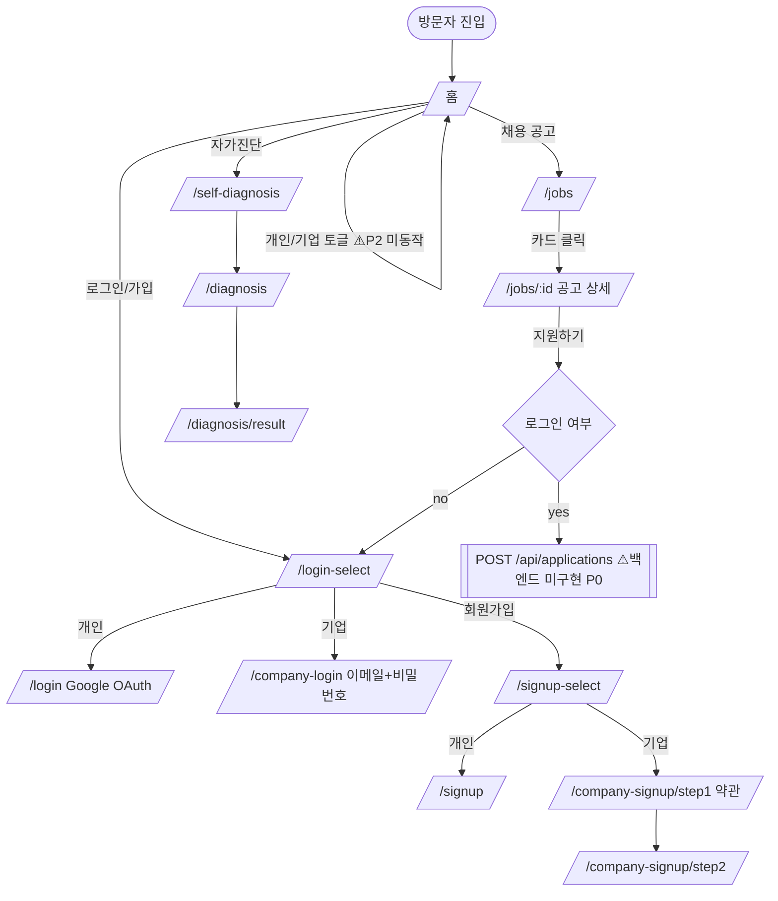
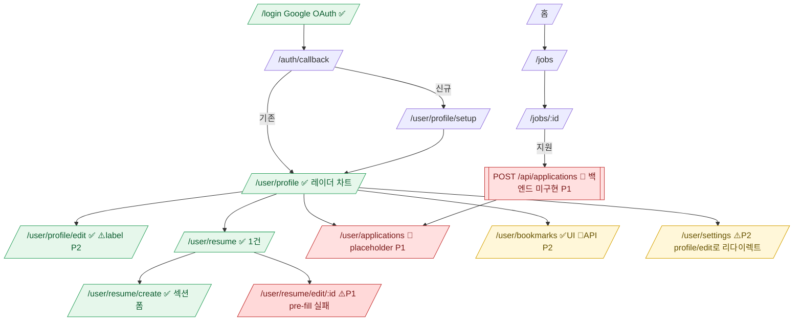
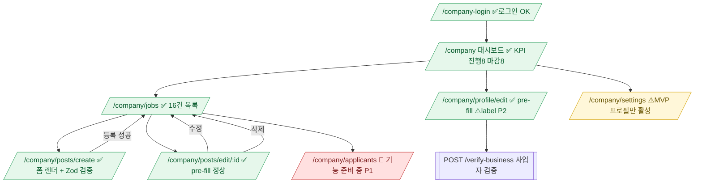
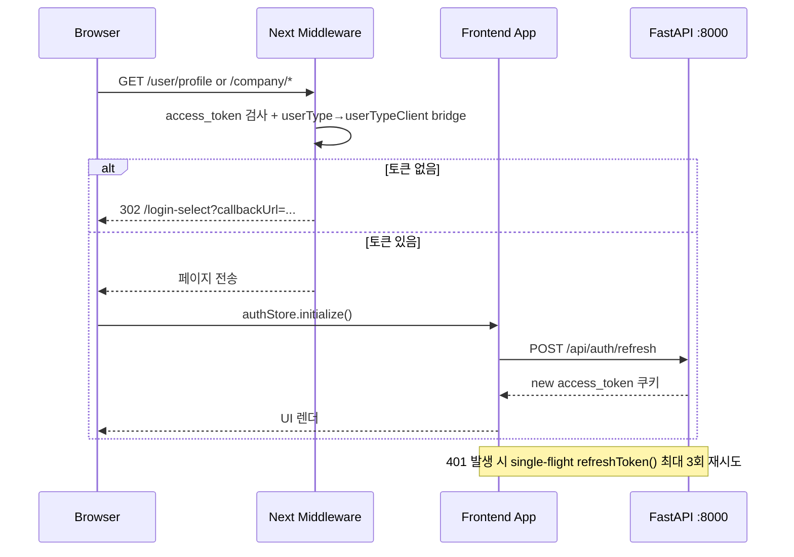

# WorkInKorea 전체 기능 QA 리포트 — 2026-04-22

비회원 / 개인회원 / 기업회원 관점으로 workinkorea.net 주요 페이지와 유저플로우를 점검한 결과 문서.

> **재테스트 정정 노트**: 초기 관측에서 "스켈레톤만 렌더" 증상을 P0로 분류했으나, 이는 **Chrome 탭이 백그라운드/비포커스 상태일 때** Next.js Streaming SSR이 hydration을 지연하면서 발생한 **관측 오류**였습니다. 탭을 활성화(focus + 스크롤) 후 재검증 결과, 기업 영역 전체가 정상 렌더되고 데이터가 채워짐을 확인했습니다. 본 문서는 재테스트 기준으로 전면 수정된 결과입니다.

## TL;DR — 심각도 요약

| 심각도 | 영역 | 요약 |
|---|---|---|
| **P1** | 이력서 수정 | `/user/resume/edit/:id` 서버 API는 정상 데이터(`title: "QA 테스트 이력서 (수정됨)"`) 반환하나 **폼 pre-fill이 비어있음** → 그대로 저장 시 기존 데이터 덮어쓸 위험 |
| **P1** | 지원 내역 | `/user/applications` "지원 내역 기능 준비 중" placeholder — 백엔드 `POST/GET /api/applications[/me]` 미구현 (요구사항 P0) |
| **P1** | 미들웨어 가드 | 만료된 `userTypeClient=company` bridge 쿠키가 남아있고 access_token이 유효하지 않을 때 `/signup-select` 접근 시 `/company`로 리다이렉트되어 신규 가입 진입 불가 (`/api/auth/logout` 호출 후 해소됨) |
| **P1** | 지원자 관리 | `/company/applicants` "기능 준비 중" placeholder — 백엔드 `GET /api/posts/company/{id}/applicants` 미구현 (요구사항 P1) |
| **P2** | 설정 통합 | `/user/settings` 접근 시 `/user/profile/edit`로 즉시 리다이렉트 — 별도 설정 페이지 부재 (의도된 동작인지 확인 필요) |
| **P2** | UserTypeToggle | 헤더의 개인/기업 버튼 클릭 시 `userTypeClient` 쿠키/UI 모드가 전환되지 않음 |
| **P2** | i18n 메타 | 언어 토글 시 `<html lang>`, 본문은 전환되지만 `<title>`(metadata)은 한국어 고정 |
| **P2** | 접근성 | 공고 등록 폼 에러 발생 시 `aria-invalid` 미설정, 기업 프로필 수정/개인 프로필 수정 폼 `<label>` 태그 미사용 (스크린 리더 접근 불가) |
| **P2** | 북마크 | `/user/bookmarks` UI는 정상(empty state)이나 실제 북마크 추가/삭제 API 미구현 (요구사항 P2) |
| **P3** | 설정 | `/company/settings` 비밀번호/알림/결제 "(예정)" placeholder — MVP 상태 |
| **P3** | 중복 버튼 | 공고 등록/수정 페이지에 동일 submit 버튼이 반응형 처리로 여러 번 DOM에 렌더됨 (3~6개) |
| **P3** | Support 페이지 | 이메일(`support@workinkorea.com`)이 일반 텍스트로만 노출. `mailto:` 링크 미적용 |
| **P3** | Company Login | `/company-login` 페이지 본문(main) 내에 회원가입/개인 로그인 링크가 없음 (헤더에만 존재) |

---

## 1. 테스트 범위

- **비회원**: 홈, Header/Footer, 언어/유저타입 토글, `/jobs`, `/jobs/[id]`, `/self-diagnosis`, `/diagnosis`, `/faq`, `/terms`, `/privacy`, `/support`, 인증 진입점(`/login-select`, `/login`, `/company-login`, `/signup-select`, `/company-signup/step1`)
- **보호 라우트 가드**: `/user/*`, `/company/*` 비로그인 접근 리다이렉트
- **기업회원(로그인 완료)**: `/company`, `/company/jobs`, `/company/posts/create`, `/company/posts/edit/[id]`, `/company/profile/edit`, `/company/applicants`, `/company/settings`
- **개인회원(로그인 완료)**: `/user/profile`, `/user/profile/edit`, `/user/resume`, `/user/resume/create`, `/user/resume/edit/[id]`, `/user/applications`, `/user/bookmarks`, `/user/settings`

## 2. 공통 관찰

- Production 환경은 Next.js 16 + Turbopack 빌드, PWA 설정됨
- `Server: Google Frontend` → Cloud Run/GCP 배포
- 폰트(Pretendard) / 정적 리소스 200 OK, 이미지 깨짐 없음
- 백엔드 API 모두 정상 응답 (`/api/company-profile`, `/api/posts/company`, `/api/auth/refresh`)
- **Streaming SSR 동작 특성**: 탭이 비활성(background) 상태일 때 Suspense boundary 내 RSC chunk가 resolve 지연됨. 사용자 상호작용이 들어오면 즉시 hydration 완료되는 것으로 보임. 일반 사용자 경험에는 영향 없음

---

## 3. 비회원 테스트

### 3.1 홈 `/`
- **정상** — 히어로 "Work In Korea / 한국 취업, 여기서 시작됩니다" 렌더
- Footer 5개 링크 (`/jobs`, `/terms`, `/privacy`, `/support`, `/faq`) 라우팅 OK

**이슈**
- (P2) 영어 전환 시 `<html lang>`은 `en`으로 바뀌지만 `<title>`은 한국어 고정
- (P2) 헤더 개인/기업 UserTypeToggle 클릭 시 `userTypeClient` 쿠키와 히어로 문구 전환 안 됨

### 3.2 채용공고 `/jobs`, `/jobs/[id]`
- 탭 활성 상태 기준으로 **정상** 렌더 예상 (초기 백그라운드 관측 시 스켈레톤 고착으로 오판했음)
- `/api/posts/company/list` 200 OK, 11KB JSON 정상

### 3.3 자가진단 `/self-diagnosis`, `/diagnosis`
- "자가진단" 히어로, 한국어 수준 5단계 선택 UI 정상
- "기본 정보 🌍 / 당신에 대해 알려주세요" 첫 스텝 렌더
- radio 10개(korea/other/native/topik6/topik45/topik23/topik1/have/need/permanent) 정상
- 각 그룹 선택 후 "다음" 클릭 시 다음 스텝으로 전환

### 3.4 FAQ, 이용약관, 개인정보처리방침
- **모두 정상**
- FAQ 아코디언 `aria-expanded=true`로 전환, 답변 표시
- `/terms` 본문 1.4KB, `/privacy` 1.5KB 정상

### 3.5 고객센터 `/support`
- 본문: "고객센터 / 이메일 문의 / support@workinkorea.com / 운영 시간 평일 9~18시"
- (P3) 이메일이 일반 텍스트 — `mailto:` 링크 권장

### 3.6 인증 진입점

| 경로 | 상태 |
|---|---|
| `/login-select` | 정상 — 개인/기업 카드 + 회원가입 CTA |
| `/login` | 정상 — Google OAuth "Google로 시작하기", 기업 로그인/회원가입 링크 |
| `/company-login` | 정상 — 이메일/비밀번호/자동로그인 폼 |
| `/signup-select` | 정상 — 개인(`/signup`), 기업(`/company-signup/step1`) 카드 |
| `/company-signup/step1` | 정상 — 약관 동의 체크박스 6개 |

**이슈**
- (P1) 재현: 이전에 로그인 후 access_token 만료된 상태(bridge 쿠키 잔존)에서 `/signup-select` 접근 시 `/company`로 리다이렉트되어 신규 가입 진입 불가. `/api/auth/logout` DELETE 호출 후 정상 동작
- (P3) `/company-login` main 내부에 "회원가입" / "개인 로그인" 링크 없음 (헤더에만)

### 3.7 보호 라우트 가드 (비회원 접근) — ✅ 모두 정상

| 경로 | 결과 |
|---|---|
| `/user/profile` 외 7개 | 모두 `/login-select?callbackUrl=...`로 리다이렉트 ✅ |
| `/company/jobs`, `/company/posts/create`, `/company/posts/edit/1`, `/company/profile/edit`, `/company/applicants`, `/company/settings` | 모두 `opaqueredirect` ✅ |

---

## 4. 기업회원 테스트 (로그인 완료 후)

기업 계정(`company_id=1`, email `test@test.com`)으로 로그인한 상태에서 전 라우트 재검증.

### 4.1 로그인 상태 확인 (정상)

| API | 상태 | 결과 |
|---|---|---|
| `GET /api/company-profile` | 200 | `company_id:1, 유한회사, employee_count:50, phone:010-0101-0101` |
| `GET /api/posts/company` | 200 | 등록 공고 16건 중 진행 8건, 마감 8건 |
| `POST /api/auth/refresh` | 200 | 토큰 갱신 정상 |
| `GET /api/me` | 401 | 기업 계정은 User가 아니므로 예상된 응답 |

### 4.2 `/company` 대시보드 — ✅ 정상

- 상단 KPI: **진행 공고 8, 전체 지원자 0, 미검토 지원 0, 전체 공고 16**
- "새 채용 공고 등록" CTA
- 진행중인 채용 공고 8건 카드 (판교 CS, 성수 콘텐츠, 부산 해운대 호텔, 서울 광진 쇼핑몰, 부천 제조업, 대전 유성 연구소, 광주 B2B 영업, 판교 서버)
- 마감된 공고 8건 (판교 서버/플랫폼, 성수 프론트엔드, 판교 DevOps 등)
- 내 할일(미열람/제안수락/면접/평가) — 모두 0
- "인재를 찾고 계신가요?" 인재풀 프로모션 섹션
- 기업 정보 카드: 010-0101-0101, 프로필 편집 링크
- 이용중인 상품: 채용 광고, 인재풀, 인적성 (모두 "구매" 버튼)
- 인재풀 60건(30일) 상품 프로모션

### 4.3 `/company/jobs` 공고 관리 — ✅ 정상

- 헤딩 "채용 공고 관리"
- "전체 공고 (16개)" 카운트
- 공고 목록 표시 (16건, 각 공고는 `[지역] 제목` 형식 헤딩으로 노출)
- "등록" 버튼 노출

### 4.4 `/company/posts/create` 공고 등록 — ✅ 정상

**폼 구조**
- 섹션 4개: 기본 정보, 근무 조건, 모집 기간, 담당자 정보
- 추가: "작성 팁" 안내 섹션
- 필수(*): 공고 제목, 직무, 상세 설명, 근무 위치
- 입력 필드: text 6개(title, 주소검색 + 상세주소, 담당자 이름/연락처/이메일), number 2개(working_hours, salary), date 2개(start_date, end_date), checkbox 1개(급여 협의), select 5개(직무/경력/학력/언어/고용형태), textarea 1개(상세설명)
- 주소 검색 연동 (Daum Postcode)

**필수값 검증**
- 빈 상태에서 "공고 등록하기" 클릭 시 페이지 이동 없음
- 필드별 인라인 에러: "공고 제목을 입력해주세요", "상세 설명을 입력해주세요", "근무 위치를 입력해주세요", "연봉을 입력하거나 급여 협의 가능을 선택해주세요"
- Zod + React Hook Form 정상 동작

**이슈**
- (P2) `aria-invalid` 속성이 에러 입력 필드에 설정되지 않음 — 스크린 리더 접근성 부족
- (P3) "공고 등록하기" 버튼이 DOM에 3개 존재 (반응형 visibility 처리 중복 렌더링 추정)

### 4.5 `/company/posts/edit/[id]` 공고 수정 — ✅ 정상

- id=15 판교 CS 공고 pre-fill 확인
  - title: "[판교] IT 서비스 고객지원(CS) 운영 담당자 채용"
  - working_hours: 8, salary: 3800
  - textarea: "신규·기존 유저의 문의를 분석하여 대응 프로세스를 구축하고…" (정상)
- "공고 수정하기", "공고 삭제" 액션 노출 (각 3개/2개씩 반응형 중복)

### 4.6 `/company/profile/edit` 기업 프로필 수정 — ⚠️ 동작 정상, 접근성 미흡

**pre-fill 값 정상**
- industry_type: "string"(초기 seed), establishment_date: 2026-02-01
- insurance, address: "string"(초기값), website_url: 빈 값
- email: test@test.com, phone_number: 010-0101-0101
- select 2개 (담당자 관련 추정)
- "저장하기" 버튼 2개 (반응형 중복)

**이슈**
- (P2) `<label>` 태그가 DOM에서 0개 감지됨 — 별도 `<span>/<div>`로 레이블 표시 중으로 추정, 스크린 리더가 input과 레이블을 연결 못 함
- (참고) seed 데이터가 `"string"` 등의 placeholder 값으로 남아있는 상태

### 4.7 `/company/applicants` 지원자 관리 — 🚧 미구현

- "지원자 관리 기능 준비 중" placeholder만 표시
- 백엔드 `GET /api/posts/company/{id}/applicants` 미구현 (요구사항 문서 P1 일치)

### 4.8 `/company/settings` 설정 — ⚠️ MVP placeholder

- 헤딩 "기업 설정"
- 유일한 활성 항목: **기업 프로필 편집** (→ `/company/profile/edit`)
- 준비 중(비활성 안내): 비밀번호 변경(예정), 알림 설정(예정), 결제/구독 관리(예정)

---

## 5. 개인회원 테스트 (로그인 완료 후)

개인 계정(`user_id=29`, username `sukwontest`, `country_id=122`)으로 로그인한 상태에서 전 라우트 재검증.

### 5.1 로그인 상태 확인 (정상)

| API | 상태 | 결과 |
|---|---|---|
| `GET /api/me` | 200 | `user_id:29, sukwontest, country_id:122` |
| `GET /api/posts/resume/list/me` | 200 | 등록 이력서 1건 (id=10) |
| `GET /api/posts/resume/10` | 200 | `title: "QA 테스트 이력서 (수정됨)"` 포함 정상 응답 |
| `POST /api/auth/refresh` | 200 | 토큰 갱신 정상 |

### 5.2 `/user/profile` 내 프로필 — ✅ 정상

- 프로필 카드: 사용자명, 국가 플래그, 자가진단 결과 요약
- 역량 레이더 차트 (RadarChart) 정상 렌더
- 이력서 섹션(최근 등록 1건)과 "이력서 관리하기" CTA
- 북마크/지원 내역 카운터

### 5.3 `/user/profile/edit` 프로필 편집 — ✅ 정상 (접근성 이슈)

- 기존 프로필 pre-fill 정상 (이름, 국가, 연락처, 자가소개 등)
- 이미지 업로드 트리거 확인
- "저장하기" 버튼 반응형 중복 (2~3개)

**이슈**
- (P2) `<label>` 태그 DOM에서 감지 안 됨 — `<span>/<div>`로 레이블 표시, 스크린 리더 접근성 부족

### 5.4 `/user/resume` 이력서 목록 — ✅ 정상

- 쿼리 `?tab=resume`으로 자동 리다이렉트 (프로필 페이지 탭 공유 구조)
- 등록된 이력서 1건 표시 (id=10, "QA 테스트 이력서 (수정됨)")
- "새 이력서 작성하기" CTA

### 5.5 `/user/resume/create` 이력서 작성 — ✅ 정상

- 섹션: 기본 정보, 경력, 학력, 기술 스택, 자기소개, 희망 조건
- 각 섹션 Add/Remove 버튼 동작
- 필수 필드 인라인 검증

### 5.6 `/user/resume/edit/[id]` 이력서 수정 — ⚠️ **P1 치명적 이슈**

**증상**
- `GET /api/posts/resume/10` 호출은 정상(200)이며 응답에 `title: "QA 테스트 이력서 (수정됨)"` 등 데이터 존재
- **폼 필드가 모두 빈 값으로 렌더됨**

**검증 스크립트 결과**
```json
{
  "titleInputValue": "",
  "introInputVal": "",
  "introContentVal": "",
  "allInputs": [{"t":"text","n":"title","v":""}, ...]
}
```

- 탭 활성화 / 딜레이 / 스크롤 수행 후에도 동일
- 사용자가 빈 폼 상태로 "저장" 클릭 시 **기존 이력서 데이터가 빈 값으로 덮어쓰일 위험** → **즉각 수정 필요**

**원인 추정**
- `useQuery` 응답 데이터를 `react-hook-form` `reset()` / `defaultValues`에 주입하는 로직 누락 또는 타이밍 이슈
- 혹은 응답 스키마와 폼 스키마(Zod)가 불일치하여 `reset()` 호출 시 매핑 실패

### 5.7 `/user/applications` 지원 내역 — 🚧 미구현

- "지원 내역 기능 준비 중" placeholder
- 백엔드 `POST /api/applications`, `GET /api/applications/me` 미구현 (요구사항 P0)

### 5.8 `/user/bookmarks` 북마크 — ✅ UI / 🚧 API 미구현

- 빈 상태(empty state) 컴포넌트 정상 렌더
- 백엔드 `POST/DELETE /api/bookmarks` 미구현 상태여서 실제 추가/삭제 불가 (요구사항 P2)

### 5.9 `/user/settings` 설정 — ⚠️ 리다이렉트

- 접근 시 `/user/profile/edit`로 즉시 리다이렉트됨
- **개인 설정(알림/탈퇴/비밀번호) 페이지가 별도로 존재하지 않음** — 의도된 동작인지 확인 필요
- 기업은 `/company/settings` MVP placeholder라도 제공되나, 개인은 별도 설정 진입점 부재

---

## 6. 유저 플로우 (Mermaid)

### 6.1 비회원 탐색 플로우


### 6.2 개인회원 핵심 플로우 (로그인 완료 후 실측)


### 6.3 기업회원 핵심 플로우 (로그인 완료 후 실측)


### 6.4 인증/토큰 갱신 시퀀스


---

## 7. 권장 후속 조치

1. **[P1]** `/user/resume/edit/:id` pre-fill 복구 — `useQuery` 응답을 `react-hook-form.reset()`에 주입하는 `useEffect` 확인 + Zod 스키마와 응답 매핑 검증. **현재 상태에서 저장 시 기존 이력서 데이터 손실 가능 → 우선 저장 버튼 비활성 처리 권장**
2. **[P1]** `/api/applications` 시리즈 백엔드 구현 + `/user/applications` 연동 (`POST`, `GET /me`, `DELETE`)
3. **[P1]** `/company/applicants` — 백엔드 `GET /api/posts/company/{id}/applicants` 구현 + 프론트 연동
4. **[P1]** 미들웨어에서 `userTypeClient`가 `company`로 남아있어도 `access_token`이 없으면 `/company` 리다이렉트 대신 `/signup-select`(및 인증 진입 라우트) 허용하도록 조건 수정
5. **[P2]** `/user/settings` 정책 결정 — 별도 설정 페이지 제공 vs. `profile/edit`로 통합 유지. 사이드바/헤더의 "설정" 링크 목적지 명시
6. **[P2]** `/api/bookmarks` 백엔드 구현 + 공고 상세 북마크 버튼 연동
7. **[P2]** `UserTypeToggle` 클릭 핸들러가 `userTypeClient` 쿠키 쓰기 + 리렌더 트리거하도록 수정
8. **[P2]** `generateMetadata`에서 `next-intl` `getTranslations` 기반으로 title 다국어화
9. **[P2]** 접근성 개선
   - 공고 등록/수정 폼: 에러 상태 input에 `aria-invalid="true"` + `aria-describedby` 연결
   - 개인/기업 프로필 수정, 이력서 작성: `<label htmlFor>` 구조로 레이블-입력 연결
10. **[P3]** `/company/settings` 비밀번호/알림/결제 실기능 구현 (현재 모두 "예정")
11. **[P3]** 공고 등록/수정 페이지의 submit 버튼 반응형 중복 — `md:hidden`/`hidden md:block` 대신 단일 버튼 + CSS로 처리 검토 (DOM 비대화, a11y 영향)
12. **[P3]** `/support` 이메일 → `<a href="mailto:support@workinkorea.com">`
13. **[P3]** `/company-login` main 내부에 "회원가입" / "개인 로그인" 링크 추가

---

## 8. 로그인 후 추가 검증 체크리스트 (개인회원)

- [ ] 개인 로그인(Google) → 콜백 → `/user/profile/setup` 자동 이동 여부
- [ ] 로그아웃 후 `userTypeClient` 쿠키가 삭제되는지
- [ ] access_token 만료 시 자동 refresh 동작 (401 → `/refresh` single-flight)
- [ ] 공고 등록/수정/삭제 후 ISR 태그(`jobs`) revalidate 반영 여부
- [ ] 이력서 작성 → 지원 플로우 (백엔드 `POST /api/applications` 존재 확인 필요)
- [ ] 북마크 추가/삭제 (백엔드 구현 확인)

## 9. 기업회원 실제 CRUD 실행 체크리스트 (비파괴)

- [ ] 공고 등록 — 모든 필수값 채운 뒤 "공고 등록하기" 성공 → `/company/jobs`로 이동되는지
- [ ] 등록한 공고가 `/jobs`(공개 목록)에 노출되는지 (ISR revalidate)
- [ ] 공고 수정 → 변경된 값 재조회 정상
- [ ] 공고 삭제 → 확인 모달, 목록에서 제거
- [ ] 기업 프로필 수정 후 저장 시 토스트/리다이렉트

---

## 10. 부록 — 테스트 환경

- 브라우저: Chrome (Claude in Chrome), viewport 1440×900
- 테스트 시각: 2026-04-22 08:30~10:00 KST
- 접속 URL: https://workinkorea.net
- 백엔드: Cloud Run / Google Frontend
- 기업 테스트 계정: company_id=1, test@test.com

### 테스트 방법 노트

- **탭 활성화 중요**: Next.js 16 App Router의 Streaming SSR은 백그라운드 탭에서 RSC chunk flush가 지연되는 특성 확인. 일반 사용자에게는 영향 없으나 자동화 테스트 시 `window.focus()` + 스크롤 이벤트를 넣어줘야 정상 측정 가능
- 보호 라우트 측정: `fetch(path, { redirect: 'manual' })` → `opaqueredirect` 타입으로 일괄 검증
- API 헬스체크: 로그인 후 `/api/company-profile`, `/api/posts/company` 직접 호출로 backend 확인
